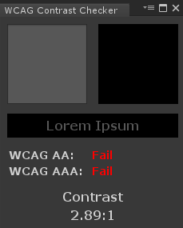

# WCAG Contrast Checker
This project adds a custom Editor Window into Unity to support the [Web Content Accessibility Guidelines](https://en.wikipedia.org/wiki/Web_Content_Accessibility_Guidelines) for contrast between two colours. You can quickly and easily check if two colours used as foreground and background will pass their *'AA'* or *'AAA'* ratings.

# Installation
Installation is simple as it only contains 1 file. You can either:
* Clone this project and use it as a base for your next Unity Project.
* Copy the contents of `ColorAccessibilityChecker.cs` and paste it into a file of the same name inside your Unity Project.
* Download and import the Unity Package available on the [releases page](https://github.com/thescottcabs/unity-wcag-contrast-checker/releases).

# Usage
The Editor Window is available under a new Menu on your main toolbar. To open it click on `Accessibility -> WCAG Contrast Checker`. Use the colour pickers to edit the colours as per your requirements.

The window can be used as a floating window or docked depending on your preference. Examples of using the window to check colours can be seen below.

